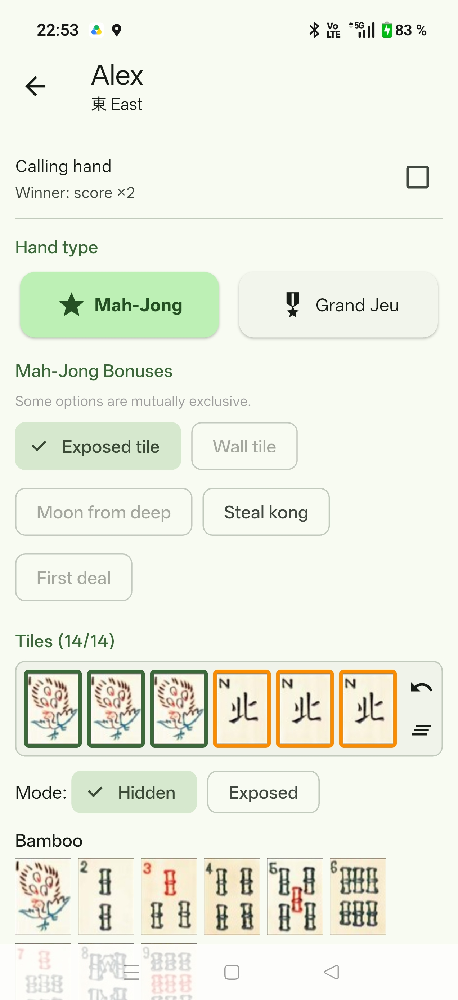
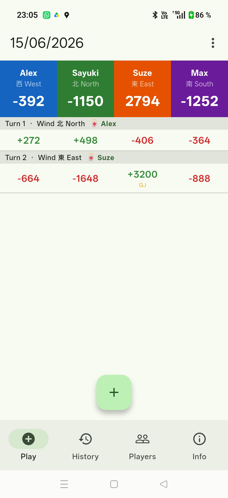
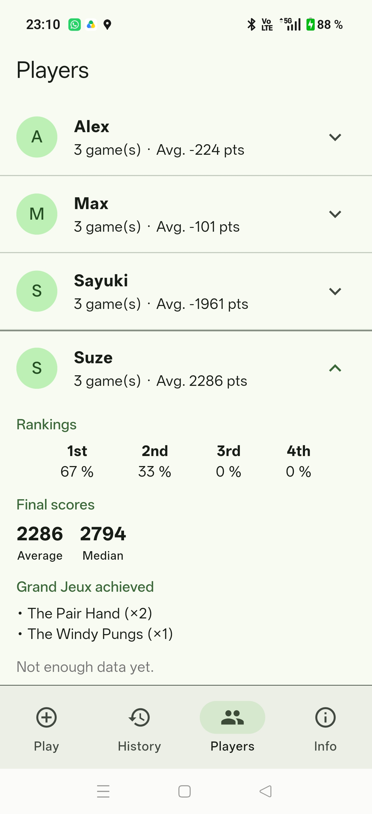
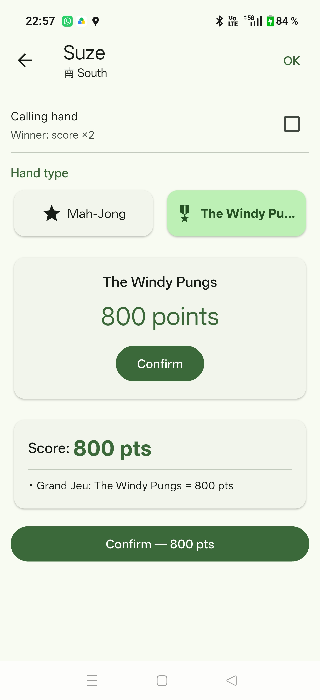
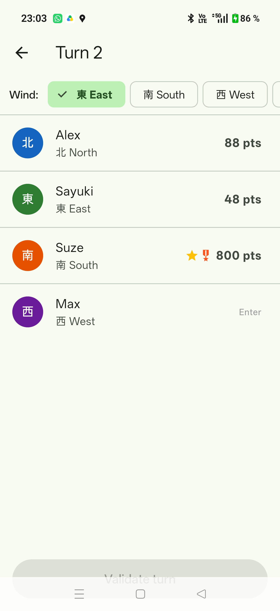
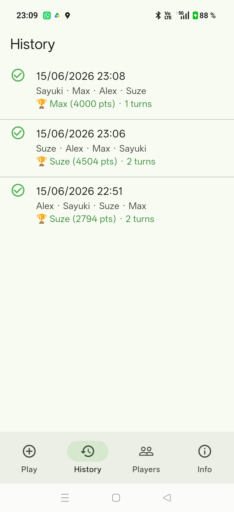
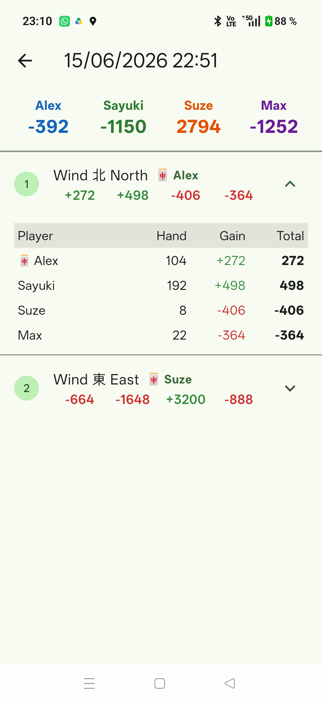
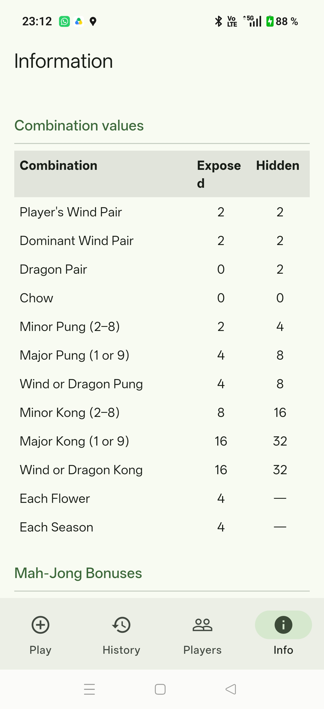
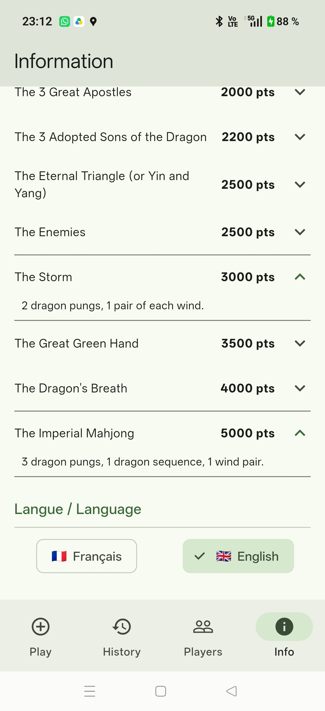

# 🀄 Mah-Jong Counter

> Suivi des scores de Mah-Jong pour 4 joueurs · Mah-Jong score tracker for 4 players

---

|  |  |  |

---

## 🇫🇷 Français

### Description

Application Android de suivi des scores de Mah-Jong pour 4 joueurs. Calcul automatique des points d'une main et distribution entre les joueurs; historique des parties et statistiques par joueur.

### Fonctionnalités

- Création de parties avec 4 joueurs nommés et assignation des vents
- Saisie des mains tour par tour avec sélection des tuiles
- Calcul automatique du score avec détail des combinaisons et multiplicateurs
- Support des Grands Jeux à score fixe
- Système avancé de distribution des points entre les joueurs
- Historique complet des parties avec détail de chaque tour
- Statistiques par joueur (classements, scores moyens, Grands Jeux réalisés)
- Interface disponible en français et en anglais

### Construire et installer

```bash
# Dépendances
flutter pub get

# Lancer sur appareil connecté
flutter run

# APK de release
flutter build apk --release
```

### Stack

Flutter · Dart · sqflite · Riverpod · Material 3

### Notes

Vibe-codé avec Claude Code. À usage personnel uniquement.

---

## 🇬🇧 English

### Description

Android app for tracking Mah-Jong scores for 4 players. Automatic score calculation of a player's hand; points distribution between players; full game history and per-player statistics.

### Features

- Create games with 4 named players and wind assignment
- Enter hands turn by turn with tile selection
- Automatic score calculation with combination and multiplier breakdown
- Support for all "Grand Jeux" (fixed-score special hands)
- Advanced system of points distribution between players
- Full game history with per-turn details
- Player statistics (rankings, average scores, Grands Jeux achieved)
- French and English interface

### Build & Install

```bash
# Dependencies
flutter pub get

# Run on connected device
flutter run

# Release APK
flutter build apk --release
```

---

### Stack

Flutter · Dart · sqflite · Riverpod · Material 3

### Notes

Vibe-coded with Claude Code. For personal use only. 

## Captures d'écran supplémentaires / More screenshots

|  |  |  |
|  |  |  |
